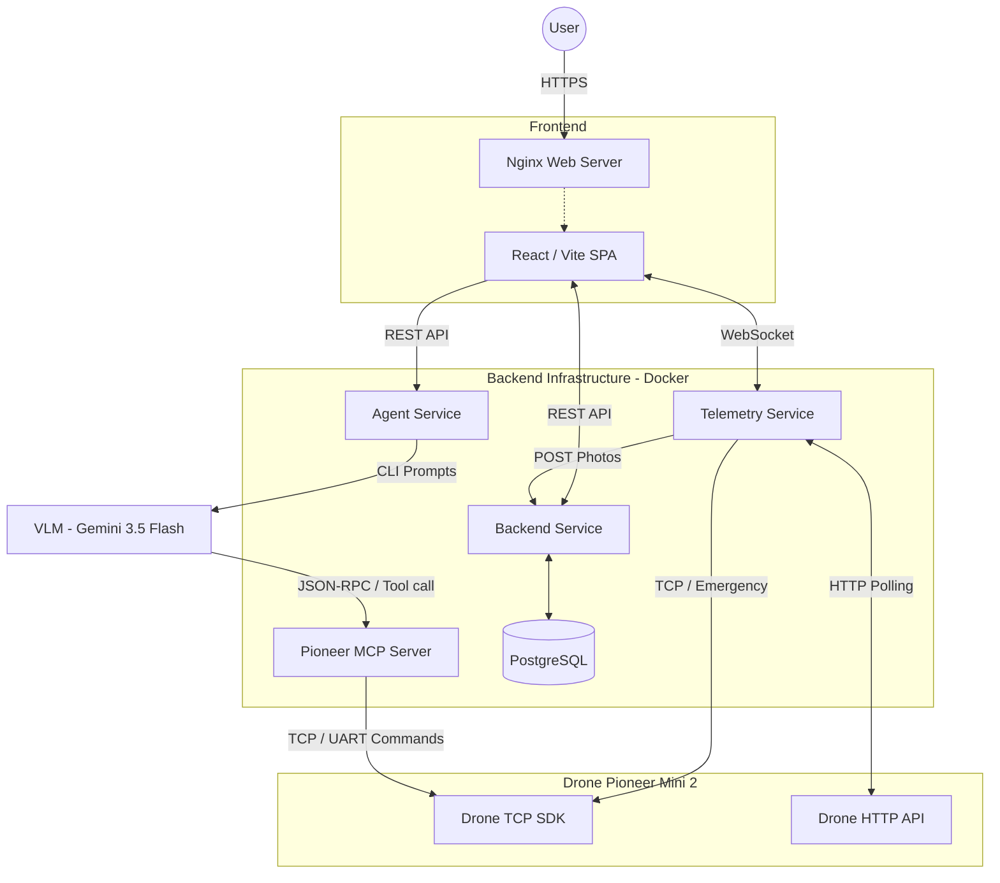

<div align="center">
  
  <h1>МОПС: Мониторинг и Обследование Поверхностей Сооружений</h1>
  <p>
    <em>Инновационная система автоматизированного инспектирования фасадов зданий с использованием беспилотной авиации, фотограмметрии и ИИ.</em>
  </p>
  <p>
    <a href="#архитектура">Архитектура</a> •
    <a href="#модули-компьютерного-зрения-ai">Компьютерное зрение</a> •
    <a href="#принцип-работы">Принцип работы</a> •
    <a href="#развертывание-docker">Развертывание</a>
  </p>
</div>

---

## О проекте

**МОПС** — профессиональный аппаратно-программный комплекс, разработанный при поддержке компании **Геоскан**. Основная задача системы заключается в полной автоматизации процесса поиска дефектов (трещин, разрушений) на фасадах и крупногабаритных сооружениях при помощи дронов.

Система позволяет оператору ставить задачи на естественном языке. Интеллектуальный агент (LLM) самостоятельно формирует полетное задание, дрон (**Pioneer Mini 2**) осуществляет облет и сбор фотографий. Бэкенд производит фотограмметрическую сшивку снимков в плоский ортофотофасад (через Agisoft Metashape) и с помощью ансамбля нейросетей (Yolo26m и Crack-SAM) локализует все повреждения.

---

## Ключевые возможности

- **Управление полетом на базе LLM:** Трансляция текстовых или голосовых команд в низкоуровневые полетные инструкции через Model Context Protocol (MCP).
- **Высокоточная фотограмметрия:** Создание ортомозаики и цифровой модели высот (DEM) фасада для устранения оптических искажений перспективы.
- **Ансамбль нейросетей для дефектоскопии:** Использование легковесной Yolo26m для быстрого поиска и тяжеловесной Crack-SAM для прецизионной сегментации трещин.
- **Телеметрия в реальном времени:** Потоковая передача координат и видео с дрона в веб-интерфейс оператора через WebSockets с минимальной задержкой.
- **Микросервисная архитектура:** Легкое развертывание компонентов системы в изолированных контейнерах через Docker Compose.

---

## Архитектура

Архитектура построена по микросервисному паттерну. Тяжелые вычислительные процессы (инференс ИИ и фотограмметрия) вынесены в отдельные сервисы и полностью изолированы от службы телеметрии, что гарантирует бесперебойную связь с дроном даже при пиковых нагрузках на сервер.



### Основные компоненты системы:
1. **Frontend**: SPA-приложение на React (сборка Vite). Выполняется на стороне клиента, раздается через Nginx.
2. **Backend**: Центральное API на FastAPI. Управляет проектами, сессиями, а также инициирует процессы фотограмметрии и детекции аномалий.
3. **Agent Service**: Модуль планирования. Передает намерения оператора в визуальную языковую модель (VLM).
4. **Pioneer MCP Server**: Сервер Model Context Protocol. Действует как мост между VLM и SDK дрона, переводя вызовы функций (tools) в понятные автопилоту команды (взлет, движение по координатам).
5. **Telemetry Service**: Сервис пассивного сбора данных. Транслирует телеметрию с дрона во Frontend и перенаправляет фотографии в Backend.
6. **Database**: PostgreSQL.

---

## Модули компьютерного зрения (AI)

Для детекции и сегментации трещин на ортофотофасаде используются две независимые архитектуры нейронных сетей, обеспечивающие баланс между скоростью и точностью.

### 1. Yolo26m
Легковесная и быстрая модель для сегментации трещин и растительности на фасаде. Обучена на закрытом наборе данных.
- **Датасет:** 8820 фотографий.
- **Метрики:**
  - Mask Precision: 72.5%
  - Recall: 64.7%
  - mAP50: 69.2%
  - mAP50-95: 42.8%

### 2. Crack-SAM (Segment Anything Model)
Специально дообученный адаптер на базе фундаментальной модели SAM (ViT-H) от Meta. Предназначен для прецизионного выделения масок трещин сложной формы.
- **Датасет:** Открытый датасет трещин (Open source).

### Размещение весовых файлов
Для корректной работы сервиса компьютерного зрения необходимо загрузить веса моделей в директорию `weights` в корне бэкенда:
- `backend/weights/yolo/best.pt` (также доступно переопределение через `YOLO_MODEL_PATH`).
- `backend/weights/cracksam/CrackSAM_adapter_d32.pth`
- `backend/weights/cracksam/sam_vit_h_4b8939.pth`

---

## Принцип работы

1. **Инициация задания:** Оператор формирует текстовый запрос. `Agent Service` отправляет его в VLM.
2. **Облет (Автопилот):** VLM через `Pioneer MCP` вызывает команды управления. Дрон выполняет облет. `Telemetry Service` передает координаты в браузер и пересылает отснятые кадры в `Backend`.
3. **Фотограмметрия:** `Backend` запускает Agisoft Metashape. Производится выравнивание камер, построение плотного облака точек и экспорт ортомозаики фасада.
4. **Детекция дефектов:** Ортофотофасад разбивается на тайлы (для сохранения детализации) и обрабатывается через Yolo26m или Crack-SAM.
5. **Агрегация (NMS):** Результаты тайлинга объединяются с помощью Non-Maximum Suppression для устранения дублирующих боундбоксов. Готовый результат отдается клиенту.

---

## Развертывание (Production vs Development)

Система предусматривает два сценария запуска: **Production** (целевая боевая среда) и **Development** (локальная разработка).

### 1. Боевая среда (Production)

В продакшене используется строгая изоляция микросервисов и максимальная оптимизация ресурсов:
- **Бэкенд-инфраструктура:** Все сервисы (`backend`, `ai_service`, `telemetry_service`, `pioneer_mcp`, а также БД `PostgreSQL`) упаковываются в изолированные Docker-контейнеры. В репозитории уже подготовлены соответствующие `Dockerfile` для каждого компонента.
- **Фронтенд:** Не использует Docker. SPA-приложение собирается в статику (`npm run build`) и раздается через высокопроизводительный веб-сервер (например, Nginx). Это снижает потребление памяти и ускоряет загрузку интерфейса для клиента.

*(Примечание: На данный момент ведется работа по адаптации аппаратных лицензий Agisoft Metashape для работы внутри Docker-контейнеров).*

### 2. Локальная разработка (Development - `start.sh`)

Для локальной разработки, тестов и обхода временных ограничений с лицензиями Metashape (которые привязываются к MAC-адресу хост-машины) используется скрипт `start.sh`.

Скрипт берет на себя всю рутину по оркестрации смешанной среды:
1. Запускает **базу данных PostgreSQL** и **Frontend (в dev-режиме)** внутри Docker (через `docker-compose up -d`).
2. Автоматически синхронизирует и устанавливает все Python-зависимости с помощью сверхбыстрого пакетного менеджера **uv** (`uv sync`).
3. Поднимает все бэкенд-микросервисы (`backend`, `ai_service`, `telemetry_service`, `pioneer_mcp`) **нативно на хост-машине** в фоновых процессах.
4. Обеспечивает корректное завершение всех процессов (graceful shutdown) и остановку контейнеров при закрытии скрипта.

**Запуск среды разработки:**
```bash
git clone https://github.com/ArduRadioKot/Geoscan_MOPS.git
cd Geoscan_MOPS
chmod +x start.sh
./start.sh
```
После запуска скрипта интерфейс будет доступен по адресу: `http://localhost:5173`.

---

## Технологический стек

- **Frontend:** React 19, Vite, Styled Components.
- **Backend:** FastAPI, PostgreSQL, Uvicorn, Python 3.12+.
- **Computer Vision:** YOLOv8 (Ultralytics), Segment Anything (SAM), OpenCV, Agisoft Metashape Python API, SAHI.
- **LLM Infrastructure:** Model Context Protocol (MCP), FastMCP, Gemini 3.5 Flash.
- **Hardware:** Pioneer SDK2 (TCP/HTTP API), Pioneer Mini 2.

---

Проект разработан при поддержке компании **Геоскан**.